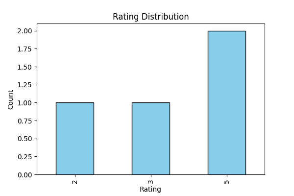

# 🚀 InsightGPT – AI-Powered Business Insights from Unstructured Data

InsightGPT is an intelligent web application that blends **Data Science**, **AI/LLMs**, and **Prompt Engineering** to generate actionable business insights from both structured and unstructured data.

<p align="center">
  
</p>

---

## 🔍 Features

- 📊 Upload CSV or Excel datasets for Exploratory Data Analysis (EDA)
- 🧠 Upload text transcripts (e.g., meeting notes, feedback) for summarization using **GPT**
- 📈 Auto-generated charts and data visualizations
- ✍️ AI-powered business insight reports in:
  - Markdown (`.md`)
  - PDF (`.pdf`)
  - PowerPoint (`.pptx`)

---

## 🛠️ Tech Stack

- **Frontend**: HTML/CSS + Bootstrap
- **Backend**: Python + Flask
- **AI/NLP**: OpenAI GPT API
- **Data Analysis**: Pandas, Matplotlib, Seaborn
- **Exporting**: ReportLab, python-pptx, markdown2

---

## 📁 File Uploads Supported

- `.csv`, `.xlsx` — for structured tabular analysis  
- `.txt`, `.vtt` — for transcript-based insights  

---

## ⚙️ Getting Started

1. Clone the repo:
```bash
git clone https://github.com/yourusername/InsightGPT.git
cd InsightGPT
```

2. Install dependencies:
```bash
pip install -r requirements.txt
```

3. Add your OpenAI API key in a `.env` file:
```bash
OPENAI_API_KEY=your_key_here
```

4. Run the app:
```bash
python app.py
```

---

## 📄 Sample Outputs

- 📄 `Business_Insights_Report.md`
- 📄 `Business_Insights_Report.pdf`
- 📊 `Business_Insights_Report.pptx`
- 📈 `static/rating_distribution.png`

---

## 💡 Example Use Case

Upload a customer feedback transcript, and InsightGPT will return:
- Key sentiments
- Actionable suggestions
- Customer pain points
- Visualization of rating distribution

---

## 📜 License

MIT License

---

## 🙋‍♂️ Author

**Your Name** – [LinkedIn]([https://www.linkedin.com/in/yourprofile/](https://www.linkedin.com/in/bharath-l-1bba20257/)) • [GitHub]([https://github.com/yourusername](https://github.com/BharathL2))

---

## 🌟 Star this repo if you found it useful!
